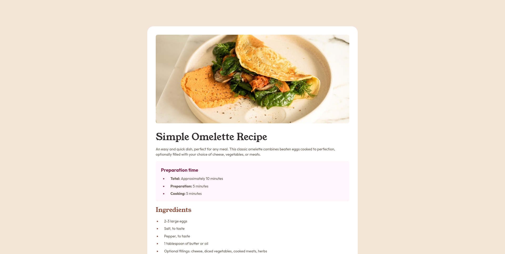

# Frontend Mentor - Recipe page solution

This is a solution to the [Recipe page challenge on Frontend Mentor](https://www.frontendmentor.io/challenges/recipe-page-KiTsR8QQKm). Frontend Mentor challenges help you improve your coding skills by building realistic projects. 

## Table of contents

- [Frontend Mentor - Recipe page solution](#frontend-mentor---recipe-page-solution)
  - [Table of contents](#table-of-contents)
  - [Overview](#overview)
    - [Screenshot](#screenshot)
    - [Links](#links)
  - [My process](#my-process)
    - [Built with](#built-with)
    - [What I learned](#what-i-learned)
    - [Continued development](#continued-development)
  - [Author](#author)

## Overview

### Screenshot

### Links

- Solution URL: [Solution URL](https://www.frontendmentor.io/solutions/recipe-page-html-css-vite-tailwind-css-fUz8o6q-TT)
- Live Site URL: [Add live site URL here](https://frontend-mentor-recipe-page-tawny-ten.vercel.app/)

## My process

### Built with

- Semantic HTML5 markup
- CSS Grid
- Vite
- Tailwind CSS

### What I learned

This is the first time I managed to use CSS grid layout, to add top and bottom margins to the card when in Desktop layout and remove them in Mobile.

### Continued development

I will surely explore further the CSS grid, since it's extremely powerful but also more complex than Flexbox

## Author

- Riccardo Bellini
